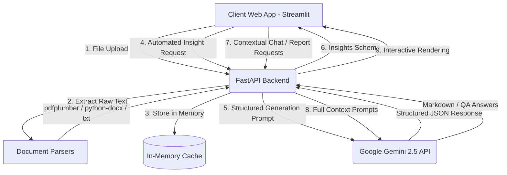

# Document Intelligence Portal

[](https://fastapi.tiangolo.com)
[](https://streamlit.io)
[](https://deepmind.google/technologies/gemini/)
[](https://python.org)

An enterprise-ready, production-style document analysis and business intelligence platform. It extracts structured insights, runs context-aware Q&A, and generates consulting-quality summaries from business documents (PDFs, DOCX, and TXT) using Google's state-of-the-art **Gemini 2.5 Flash** LLM.

---

## 🏛️ System Architecture



---

## 🚀 Key Features

### 1. High-Fidelity Document Parsing
- **PDF Extraction**: Multi-page PDF text compilation powered by `pdfplumber`.
- **Word (.docx) Structure Preserver**: Unlike simple text dump tools, the custom parser iterates directly over the underlying XML body tree. This preserves the logical reading order of tables interspersed between paragraphs.
- **Table Cell De-duplication**: Handles cell spans and merged headers in DOCX tables by tracking seen cells, avoiding redundant double-reads.
- **Encoding Recovery**: Decodes plain text files with automatic fallbacks for standard encodings (`utf-8`, `latin-1`, `utf-16`) to support legacy exports.

### 2. Structured JSON Audits
- Forces Gemini to comply with a rigorous output JSON schema using modern SDK Structured Output generation rules.
- Guarantees 100% valid JSON matching the Pydantic schema structure:
  - **Key Facts**: Core summaries, timelines, names, and statements.
  - **Important Numbers**: Numeric financial data, percentages, counts, and dates.
  - **Action Items**: Key recommendations, assignees, and tasks.
  - **Risks**: Flagged vulnerabilities, legal issues, or anomalies.

### 3. Contextual Chat Q&A
- Integrates the parsed text within the model's system prompt instructions.
- Constrains the model's outputs to *only* information present in the source text, preventing standard LLM hallucinations.

### 4. Executive Summaries
- Compiles standard markdown consulting summaries with predefined sections (Executive Summary, Key Findings, Numbers & Data, Risks & Recommendations), equipped with direct download triggers.

### 5. Premium Dark Mode UX
- Styled with modern custom CSS overrides to replace the default Streamlit dashboard layout.
- Features glassmorphic cards, smooth hover transition animations, responsive column metrics, and clear diagnostic alerts for rate-limiting.

---

## 📂 Project Structure

```text
document-intelligence-tool/
├── backend/
│   ├── main.py              # FastAPI server, CORS middleware, endpoints, and in-memory cache
│   ├── parser.py            # Custom document parser logic (PDF, Word, Text)
│   ├── llm.py               # Google Gemini 2.5 client wrappers & structured prompt templates
│   └── schemas.py           # Pydantic data contract models & descriptions
├── frontend/
│   └── app.py               # Streamlit responsive frontend & custom CSS dashboard layout
├── requirements.txt         # Core Python dependencies
├── .env.example             # Template for local environment variables
├── .gitignore               # Configured git ignore profile
└── README.md                # Detailed project documentation
```

---

## 🛠️ Setup & Installation

### 1. Clone the Repository
```bash
git clone https://github.com/r1-yash/Document-Intelligence.git
cd Document-Intelligence
```

### 2. Set Up Virtual Environment
Set up a clean virtual environment and install the required dependencies:
```bash
python3 -m venv .venv
source .venv/bin/activate
pip install -r requirements.txt
```

### 3. Configure Environment Profiles
Create your `.env` file from the template:
```bash
cp .env.example .env
```
Open `.env` and fill in your Gemini API key:
```env
GEMINI_API_KEY=your_actual_api_key_here
PORT=8000
HOST=127.0.0.1
```

---

## 🚦 Execution Guide

### Step 1: Run the Backend Service
Start the FastAPI server:
```bash
uvicorn backend.main:app --port 8000 --reload
```
You can access the interactive Swagger API sandbox at [http://127.0.0.1:8000/docs](http://127.0.0.1:8000/docs).

### Step 2: Run the Streamlit Interface
In a separate terminal shell, activate the virtual environment and run the app:
```bash
streamlit run frontend/app.py --server.port 8501
```
The application will open automatically in your browser at [http://localhost:8501](http://localhost:8501).

---

## 🔍 API Endpoint Specifications

| Endpoint | Method | Input Payload | Response Schema | Description |
| :--- | :--- | :--- | :--- | :--- |
| `/upload` | `POST` | `Multipart/Form-Data` | `UploadResponse` | Parses binary document streams and returns the assigned `doc_id`. |
| `/insights` | `POST` | `DocumentRequest` | `InsightsResponse` | Prompts Gemini 2.5 to extract structured JSON fact summaries. |
| `/query` | `POST` | `QueryRequest` | `QueryResponse` | Answers natural language questions constrained by the document text. |
| `/report` | `POST` | `DocumentRequest` | `ReportResponse` | Generates a formatted consultant Markdown summary report. |

---

## 🔧 Troubleshooting & Tips

### 1. Rate Limiting (429 Resource Exhausted)
Google AI Studio free tier keys have a rate limit of **5 requests per minute**. If the UI shows:
> *⚠️ Gemini API Rate Limit Exceeded (429). Please wait a few seconds before retrying.*

Wait **15-30 seconds** for the window to clear and click **`🔄 Try Extracting Insights Again`** on the left dashboard card to retry without re-uploading the file.

### 2. Editor Import Warnings
If your code editor shows red squiggly lines on imports (e.g. `fastapi`, `pdfplumber`), make sure your editor's Python interpreter is set to use the virtual environment:
1. Open the Command Palette (`Cmd+Shift+P` on Mac, `Ctrl+Shift+P` on Windows).
2. Choose **Python: Select Interpreter**.
3. Select the path pointing to `./.venv/bin/python`.
